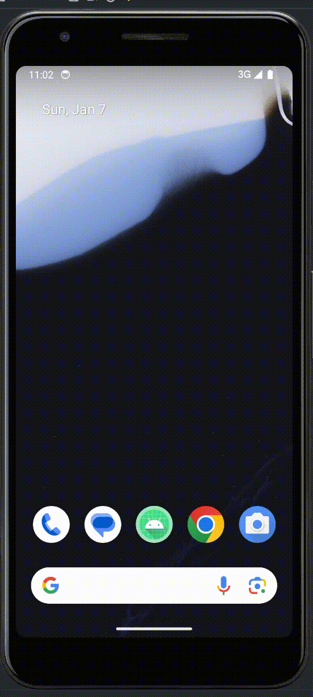

## Example Android (Java) Project

    

<h1 align="center">
    💻 Technologies
</h1>

    

<h1 align="center">
    🌟 Spread the word!
</h1>

If you want to say thank you:

- Add a GitHub Star to the project!
- Follow my GitHub [bardiademon](https://github.com/bardiademon)

<h1 align="center">
    ⚠️ License & 📝 Credits
</h1>

by bardiademon [https://bardiademon.com](https://www.bardiademon.com)